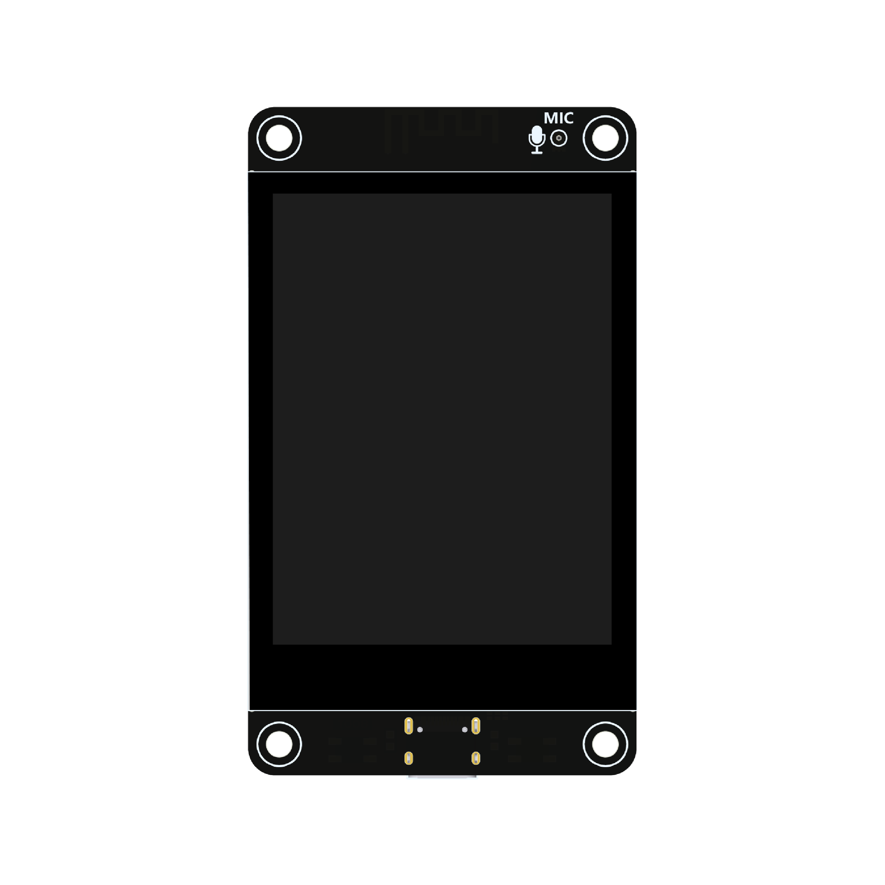

# ESP32-S3 Full-Duplex Intercom

🎙️ **Full-duplex audio intercom system** based on ESP32-S3 with hardware echo cancellation, noise suppression, and touch screen UI.



## ✨ Features

### Audio Processing
- **Full-duplex communication** — simultaneous talk and listen
- **ESP-SR AEC** — Acoustic Echo Cancellation with ~500ms echo tail (filter_len=16)
- **ESP-SR NS** — Noise Suppression in mild mode
- **ESP-SR AGC** — Automatic Gain Control (target -2dBFS)
- **ADPCM compression** — 4:1 compression ratio for efficient network transmission
- **16kHz / 16-bit mono** audio pipeline
- **32ms frame size** (512 samples)

### Network
- **UDP streaming** — low latency audio transport
- **mDNS discovery** — automatic device discovery on local network
- **WiFi configuration** — via touch screen UI

### User Interface
- **2.8" IPS touch display** (240×320, ILI9341)
- **LVGL 9.x** graphics library
- **Russian language support** with custom Cyrillic font
- **Real-time audio levels** visualization
- **Device list** with mDNS discovered intercoms
- **Settings screen** for audio parameters

## 🛠️ Hardware

### Supported Board
**ESP32-S3-ES3C28P** — 2.8-inch Display Development Board

| Component | Specification |
|-----------|--------------|
| MCU | ESP32-S3 (QFN56, dual-core @ 240MHz) |
| RAM | 512KB SRAM + 8MB PSRAM |
| Flash | 16MB |
| Display | 2.8" IPS TFT (ILI9341, 240×320) |
| Touch | Capacitive (FT6336G) |
| Audio Codec | ES8311 |
| Amplifier | FM8002E |
| Microphone | MEMS |
| Connectivity | WiFi 2.4GHz, Bluetooth 5.0 |

### Additional Hardware Capabilities
- MicroSD card slot (SDIO 4-bit)
- RGB LED (WS2812B)
- USB Type-C (programming and power)
- Battery connector (3.7V Li-Po with charging circuit)

## Pin Mapping

### LCD (ILI9341V)
| Function | GPIO | Description |
|----------|------|-------------|
| CS | IO10 | Chip select (active low) |
| DC | IO46 | Data/Command select |
| SCK | IO12 | SPI clock |
| MOSI | IO11 | SPI data out |
| MISO | IO13 | SPI data in |
| RST | RST | Reset (shared with ESP32-S3) |
| BL | IO45 | Backlight control |

### Touch Screen (FT6336G)
| Function | GPIO | Description |
|----------|------|-------------|
| SDA | IO16 | I2C data |
| SCL | IO15 | I2C clock |
| RST | IO18 | Touch reset |
| INT | IO17 | Touch interrupt |

### SD Card (SDIO)
| Function | GPIO | Description |
|----------|------|-------------|
| CLK | IO38 | SDIO clock |
| CMD | IO40 | SDIO command |
| D0 | IO39 | Data line 0 |
| D1 | IO41 | Data line 1 |
| D2 | IO48 | Data line 2 |
| D3 | IO47 | Data line 3 |

### Audio (I2S)
| Function | GPIO | Description |
|----------|------|-------------|
| AMP_EN | IO1 | Amplifier enable (active low) |
| MCLK | IO4 | Master clock |
| BCLK | IO5 | Bit clock |
| DOUT | IO6 | Data output (to speaker) |
| LRCK | IO7 | Left/Right clock |
| DIN | IO8 | Data input (from mic) |

### Other Peripherals
| Function | GPIO | Description |
|----------|------|-------------|
| RGB LED | IO42 | WS2812B LED |
| BOOT | IO0 | Boot mode button |
| UART0 TX | IO44 | Debug UART |
| UART0 RX | IO43 | Debug UART |
| Battery ADC | IO9 | Battery voltage sense |
| Expansion | IO2/3/14/21 | General purpose I/O |

## Hardware Specifications

### ESP32-S3 Parameters
- **CPU**: Xtensa LX7 dual-core @ 240MHz
- **ROM**: 384KB
- **SRAM**: 512KB + 16KB RTC SRAM
- **PSRAM**: 8MB (internal OPI)
- **Flash**: 16MB (external SPI)
- **Operating Voltage**: 3.0-3.6V

### Display Parameters
- **Size**: 2.8 inch
- **Type**: IPS TFT
- **Resolution**: 240×320 pixels
- **Colors**: 262K (RGB666) / 65K (RGB565)
- **Driver**: ILI9341V
- **Interface**: 4-wire SPI
- **Backlight**: 4× white LEDs
- **Operating Temp**: -30°C to +80°C

### Touch Screen Parameters
- **Type**: Capacitive
- **Driver**: FT6336G
- **Interface**: I2C
- **Operating Temp**: -30°C to +80°C

### Power Specifications
- **Operating Voltage**: 5V (USB Type-C)
- **Backlight Current**: 79mA
- **Display Only**: ~140mA
- **Full Operation**: ~560mA (display + speaker + charging)
- **Battery**: 3.7V Li-Po (with TP4054 charging IC)
- **Charging Current**: Max 500mA, Typical 290mA

## BSP Components

This BSP provides the following components:

### Core Headers
- `bsp/esp32_s3_es3c28p.h` - Main BSP header
- `bsp/esp-bsp.h` - Common BSP definitions
- `bsp/config.h` - Board configuration
- `bsp/display.h` - Display interface
- `bsp/touch.h` - Touch interface

### Source Files
Located in `src/` directory:
- Display driver implementation
- Touch controller interface
- SD card support
- Audio codec configuration
- Board initialization routines

## 📦 Dependencies

- **ESP-IDF** v5.4+
- **ESP-SR** v2.3+ (AEC, NS, AGC)
- **LVGL** v9.x
- **esp_codec_dev** ~1.5
- **esp_lcd_ili9341** ^2.0.1
- **esp_lcd_touch_ft5x06** ^1.0.7
- **esp_lvgl_port** ^2
- **mdns**

## 🚀 Building

```bash
# Clone repository
git clone https://github.com/agran/esp32_s3_es3c28p_demo2.git
cd esp32_s3_es3c28p_demo2

# Set target
idf.py set-target esp32s3

# Configure (optional)
idf.py menuconfig

# Build
idf.py build

# Flash
idf.py -p COMx flash monitor
```

## ⚙️ Configuration

### WiFi
Configure WiFi credentials via touch screen or set default in code:
```c
#define DEFAULT_WIFI_SSID     "YourSSID"
#define DEFAULT_WIFI_PASSWORD "YourPassword"
```

### Audio Parameters (via Settings screen)
- **AGC Gain** — automatic gain control target level
- **Noise Gate** — silence detection threshold
- **AECM Delay** — echo cancellation delay compensation

## 📊 Performance

| Metric | Value |
|--------|-------|
| Audio latency | ~50-80ms (end-to-end) |
| CPU load (TX task) | ~48-52% |
| Echo tail | ~500ms |
| Sample rate | 16kHz |
| Frame size | 32ms (512 samples) |
| Network bandwidth | ~32 kbps (ADPCM) |
| Binary size | ~1.39 MB |

## 📁 Project Structure

```
esp32_s3_es3c28p_demo2/
├── components/
│   └── esp32_s3_es3c28p/    # Board Support Package
│       ├── include/bsp/     # Public headers
│       ├── src/             # BSP implementation
│       └── Kconfig          # BSP configuration
├── main/
│   ├── main.c               # Application code (~4900 lines)
│   ├── font_montserrat_14_cyrillic.c  # Cyrillic font
│   └── idf_component.yml    # Main component dependencies
├── doc/                     # Documentation & images
├── CMakeLists.txt           # Project CMake
├── sdkconfig.defaults       # Default configuration
└── partitions.csv           # Partition table
```

## 📝 Credits

This project is based on [ngttai/esp32_s3_es3c28p](https://github.com/ngttai/esp32_s3_es3c28p) BSP.

## 🤝 Contributing

Contributions are welcome! Please open an issue or submit a pull request.

---

Made with ❤️ for ESP32-S3